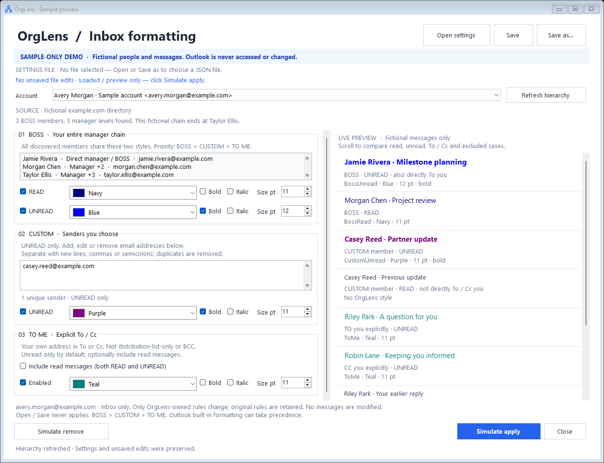

# OrgLens

A native **classic Outlook for Windows** COM add-in that discovers the selected
Exchange account's published manager chain and creates real Outlook conditional
formatting rules for BOSS, custom senders, and mail addressed explicitly to you.
No Graph application registration, cloud service, or email-body analysis is involved.

[Download Setup.exe](https://github.com/jelllove/OrgLens/releases/download/v0.2.4/OrgLens-0.2.4-Setup.exe)
| [All downloads](https://github.com/jelllove/OrgLens/releases/latest)
| [Release notes](CHANGELOG.md)
| [MIT license](LICENSE)



*Actual application screenshot using fictional people and messages. No real mailbox data.*

**Quick install:** close Outlook, double-click **OrgLens-0.2.4-Setup.exe**, and
follow the setup wizard. No unzip, terminal commands, or administrator rights
are required. Reopen Outlook and choose **OrgLens > Formatting rules**.

## Three groups, four styles

| Group | Matches | Styles |
| --- | --- | --- |
| BOSS | Any manager in your entire published management chain | One shared **read** style and one shared **unread** style |
| Custom | Mail from any address in your editable sender list | **Unread only**, one shared style |
| To me | You are explicitly named in **To or Cc** | One style, **unread only** by default; uncheck the option to include read mail |

Every style has enable/disable, a **color swatch + name** selector, bold, italic, and an integer font
size from **1 to 127 points**. There is no longer a separate style per manager.
All 17 native Outlook colors appear in both the dropdown list and its selected field.
Use the read-only BOSS member list to verify who was discovered.

Within OrgLens, overlap priority is **BOSS > Custom > To me**. Filters exclude
higher-priority matches so only one OrgLens style applies. If a higher-priority
style is disabled, a lower-priority matching group can still apply. Custom rules
never apply to read messages.

To me uses Outlook's native explicit-recipient flags, not a substring search for
your display name. It permits additional recipients but excludes delivery solely
through distribution-list membership or Bcc. Its accuracy depends on Exchange's
recipient metadata in the selected account's Inbox.

## Try the interface first

Download and extract [the release ZIP](https://github.com/jelllove/OrgLens/releases/latest),
then open `OrgLens.Preview.exe` in the extracted folder.
After building from source, use `artifacts\OrgLens-0.2.4\OrgLens.Preview.exe`.

The clearly marked demo uses fictional people and messages. Its Apply and Remove
buttons change only the demo's in-memory state. It does not connect to Outlook.
Open/Save settings in the demo really reads/writes the file you select, without
changing Outlook.

## Keep working in Outlook

The add-in's settings window is **modeless** and not always-on-top: switch back to
Outlook to read mail, change folders, or work in another window without closing
OrgLens. Clicking **OrgLens > Formatting rules** again brings back the same window,
restoring it if minimized and preserving your edits.

Changing Outlook's active folder does not retarget your settings: **Apply** still
uses the account selected in OrgLens and asks for confirmation.
File pickers and confirmation dialogs temporarily require a response; directory
refresh and Apply run on Outlook's UI thread, not as background COM operations.

Closing OrgLens normally prompts about unsaved changes. Exiting Outlook or
disconnecting the add-in also closes OrgLens; **save your settings file first**,
because unsaved edits cannot prevent the host from shutting down.

## Save settings to your own file

1. Configure all groups and your custom email list.
2. Choose **Save As** and select the filename and location of a JSON file.
3. Next time, choose **Open settings** and select that file.
4. Review the loaded configuration, then explicitly **Apply to Inbox** when ready.

File operations work independently of Outlook availability. Saving or opening a
file never automatically applies rules. A malformed file, unsupported version,
invalid address, color, or font size is reported rather than replacing your
current settings with defaults. File replacement is atomic; failed validation
does not truncate an existing settings file.

The versioned JSON contains all four styles, the custom sender list, and the
To me unread option. It does **not** contain account identifiers, passwords,
tokens, messages, or discovered manager identities. The BOSS chain is discovered
for the currently selected account rather than replayed from an old file.
Custom addresses are plain text: choose a suitable location for your contacts.

Successful real Outlook Apply also remembers the configuration per account under
`%LOCALAPPDATA%\OrgLens\Profiles`. This cache is separate from your chosen portable
file: applying does not overwrite that file; save it explicitly when desired.
If the account cache cannot be saved, OrgLens attempts to roll back the native
view changes and reports the failure. Removing native rules keeps your saved
configuration available for later reuse.

## Install the actual add-in

Requirements: Windows 10/11, classic Outlook for Windows (32-bit or 64-bit), .NET Framework 4.8,
and a configured Exchange/Microsoft 365 account. This does **not** support the new
Outlook, Outlook on the web, Mac, IMAP, or personal Outlook.com manager discovery.
Company policies may prohibit unsigned or user-installed COM add-ins; this local
prototype is unsigned and does not bypass those policies.

1. Download [OrgLens-0.2.4-Setup.exe](https://github.com/jelllove/OrgLens/releases/download/v0.2.4/OrgLens-0.2.4-Setup.exe).
2. Close classic Outlook.
3. **Double-click the EXE** and follow the setup wizard. It checks prerequisites,
   installs the files, and registers the correct 32-bit or 64-bit add-in automatically.
4. Reopen classic Outlook. Select **OrgLens > Formatting rules**.
5. Select your Exchange account. OrgLens automatically reads its manager chain.
6. Configure BOSS read/unread, custom senders, and To me; or open a saved settings file.
7. Click **Apply** and confirm the selected Inbox.

Setup installs under `%LOCALAPPDATA%\OrgLens\Addin` for the current user. It can
upgrade the previous ZIP/script installation in that same directory, without
discarding your account preferences or portable JSON files. It never terminates
Outlook, automatically applies formatting, or changes execution policy.

The EXE is not digitally signed. Windows or your organization may warn about
an unknown publisher or block it; if blocked, ask IT to approve/sign the package.
The installer does not bypass security or add-in policies.

The ZIP remains an **optional developer/manual-deployment download**, not a
prerequisite for using Setup.exe. Its original `Install.ps1` and `Uninstall.ps1`
scripts are retained for administrators who explicitly choose scripted deployment.

The rules apply to existing and future matching messages displayed in the
**OrgLens - Inbox** view. This changes the message-list view, not message bodies
or the messages' importance/category flags.

## Scope and safety

### Important: upgrade from 0.2.0

Outlook builds can clear an `AutoFormatRule.Filter` when `View.Save()` or
`View.Apply()` is called. Version 0.2.0 could consequently leave enabled rules
with empty conditions, matching every message instead of just the intended senders.

Version 0.2.1 saves the **AutoFormatRules collection** and selects the view through
`Explorer.CurrentView`, then verifies the saved conditions. It does not call
`View.Save/Apply` after writing conditions. If verification fails, OrgLens disables
its rules instead of confirming success. Rollback snapshots actual rule conditions
and fonts, not `View.XML` (which does not contain these rules).

Close Outlook, install the latest version, reopen it, refresh your BOSS hierarchy, and **Apply**
again to replace the previously saved empty rules. Your existing JSON settings
remain compatible. Installing alone does not repair mailbox views.

Complex sender/read-state/priority conditions are stored as DASL; Outlook's basic
From textbox is not a reliable representation of the entire generated condition.
Use OrgLens's BOSS member list and the persisted filter rather than assuming a
blank basic textbox means an unrestricted rule. Version 0.2.1 explicitly verifies
the actual stored condition before reporting a successful Apply.

- Reads the selected account's Exchange address book, not arbitrary mail content.
- Reads managers until the directory publishes no further manager. Missing,
  stale, and offline address-book data can limit discovery; a visible explanation
  is shown. Cycles and unexpectedly long chains are rejected, not silently cut.
- Opening settings or clicking Refresh does not write rules. After a reporting
  change, **Refresh and Apply** again; OrgLens is not a background org-sync service.
- If discovery fails, settings can still be edited and saved. Disable both BOSS
  styles to apply only Custom/To me without a verified hierarchy. A successfully
  discovered empty chain creates no BOSS matches; it is not an all-senders rule.
- Uses exact sender SMTP and legacy Exchange addresses, not display-name matches.
  Custom SMTP addresses are also resolved to Exchange legacy addresses when
  available. Unpublished aliases, send-on-behalf-of mail, and messages with missing
  sender metadata may not match. Only the actual sender is considered.
- The first Apply copies the Inbox's current table view to a private, folder-only
  **OrgLens - Inbox** view. The original view is not edited.
- Preserves Outlook's built-in and unrelated custom rules in the copied view.
  Updates and Remove affect only rules with OrgLens's strict versioned identifier.
  Existing v0.1 per-manager rules are replaced by the four grouped rules only on
  explicit Apply. v0.1 styles are not automatically guessed/merged into a group.
- Outlook's built-in rules have precedence and cannot be reordered below custom
  rules. The UI preview is illustrative; unread, overdue, conversation, theme,
  and other Outlook formatting can affect the final appearance.
- Native rules persist in the Outlook view. Changing to another view hides
  OrgLens formatting; they are not promised to sync to other Outlook clients.
- Remove leaves the view and all unrelated rules intact. If a write fails,
  OrgLens attempts to restore the view and explicitly reports rollback failures.
- No automatic plugin registration, email changes, or Outlook shutdown on build.

## Uninstall

If you want to remove the formatting, first click **Remove** in OrgLens.
Close Outlook, then use **Windows Settings > Apps > Installed apps > OrgLens >
Uninstall**. This removes the installed program and its current-user registration,
not Outlook view settings or other add-ins.
Account caches and your explicitly saved JSON files are retained.
For an older ZIP-only installation that has not been upgraded with Setup.exe,
use its `Uninstall.ps1` script instead.

## Build and verify

```powershell
git clone https://github.com/jelllove/OrgLens.git
Set-Location .\OrgLens
```

Windows with a .NET SDK, the .NET Framework 4.8 targeting pack, and Office 15/16
primary interop assemblies (PIAs) is required. Creating the EXE also requires
[Inno Setup 6.7 or newer](https://jrsoftware.org/isinfo.php):

```powershell
winget install --id JRSoftware.InnoSetup --exact --source winget --scope user
```

Then build:

```powershell
.\scripts\Build.ps1
```

The script builds the solution, runs executable logic/COM contract checks and
the sample UI smoke test without a separate test runner, and creates the Setup EXE,
developer ZIP, and their `.sha256` checksums under `artifacts`. The package includes the preview,
add-in, installer/uninstaller, README screenshot, release notes, and MIT license.
NuGet restore downloads Newtonsoft.Json, used for complete-document and typed
settings validation; its runtime DLL and MIT license are included in the install package.

If ISCC is installed elsewhere, pass `-InnoCompilerPath "C:\path\ISCC.exe"`.
`-SkipInstaller` builds only the developer ZIP; `scripts\Build-Installer.ps1`
can rebuild Setup.exe from an already built package without rerunning the app build.

Optional integrity verification (not required for installation), in PowerShell:

```powershell
(Get-FileHash .\OrgLens-0.2.4-Setup.exe -Algorithm SHA256).Hash.ToLowerInvariant()
Get-Content .\OrgLens-0.2.4-Setup.exe.sha256
```

The first line must match the hash at the start of the checksum file.
These checksums detect download corruption, not publisher authenticity; the
prototype is not digitally signed.

PIAs are compile-time references; types are embedded in the add-in. By default
they are resolved from `%WINDIR%\assembly\GAC_MSIL`. If installed elsewhere, pass
`-p:OfficePiaRoot="..."` to `dotnet build OrgLens.sln`. The custom root must contain
the same `Microsoft.Office.Interop.Outlook` and `office` subdirectory layout.

Focused checks:

```powershell
dotnet build .\tests\OrgLens.Tests\OrgLens.Tests.csproj -c Release
.\tests\OrgLens.Tests\bin\Release\net48\OrgLens.Tests.exe
.\src\OrgLens.Preview\bin\Release\net48\OrgLens.Preview.exe --smoke-test
```

Native installer integration tests:

```powershell
.\scripts\Test-Installer.ps1
```

These compile clearly marked **test-only** installers with unique registry and
application identities, exercise installation and uninstallation in temporary
directories, and clean up afterward. They never register a real Outlook add-in,
open Outlook, or modify your existing installation. Test overrides are compile-time
only and are not available in the published Setup.exe.

Optional read-only integration check, with classic Outlook already running:

```powershell
.\tests\OrgLens.Tests\bin\Release\net48\OrgLens.Tests.exe --outlook-read-only
```

This attaches to the existing Outlook process and reads the first Exchange
account's hierarchy and saved configuration. It prints counts only, does not register
the add-in, and does not write any mailbox/view settings.
It exits with code 3 after 45 seconds if Outlook does not complete the request.
Dismiss any Outlook sign-in or programmatic-access prompts before retrying.

The account-enumeration read-only check can be blocked by Outlook's external
object-model access controls. It is distinct from the in-process add-in.

An explicit native integration test creates a temporary private view in the
currently open folder, uses fictional senders, temporarily selects it, and restores
the original selection and removes the test view in `finally`:

```powershell
powershell.exe -NoProfile -STA -File .\scripts\Test-OutlookRulePersistence.ps1
```

This is not run by the normal build. It verifies actual condition/font persistence,
view switching, updates to an active view, rollback, fail-closed verification and
removal without changing existing user rules. It was used to reproduce the 0.2.0
bug and validate the 0.2.1 fix in classic Outlook. Your organization's manager data
and end-to-end sender matching still depend on your actual directory and mailbox.

The source separates pure hierarchy/filter/reconciliation logic (`OrgLens.Core`),
native controls and sample service (`OrgLens.Desktop`), the real Office integration
(`OrgLens.Outlook`), and the standalone demo launcher (`OrgLens.Preview`).

Automated local checks do not substitute for testing your tenant's address book
and real Outlook rendering. If the tab is missing, check **File > Options >
Add-ins > Manage COM Add-ins** and your organization's add-in policy.

## Repository and license

### Icon attribution

The blue organization-chart mark is adapted from
[Lucide Network](https://lucide.dev/icons/network), by Lucide Icons and Contributors,
under the [ISC license](https://github.com/lucide-icons/lucide/blob/main/LICENSE).
It is free for commercial use and modification with the copyright/license notice retained.
OrgLens changes the stroke color to `#2563eb` and renders Windows PNG/ICO sizes;
the icon geometry is unchanged. It is not a Microsoft or Outlook logo.

The source is `assets/orglens.svg`; the upstream SVG blob is
`e166b3535ca33f9ceee49d2215dd78374689865e`.
The complete upstream notice is retained as `assets/Lucide.LICENSE.txt`,
embedded in the UI assembly, and installed as `Lucide.LICENSE.txt`.
Regenerate the checked-in PNG/ICO assets using built-in Windows WPF:

```powershell
powershell.exe -NoProfile -STA -File .\scripts\Generate-Icons.ps1
```

No additional image-conversion packages are required.

### Software licenses

Source and documentation are licensed under the [MIT License](LICENSE).
Newtonsoft.Json is a separate MIT-licensed dependency; its original license notice
is preserved in every package as `Newtonsoft.Json.LICENSE.md`.
The Windows installer is built with [Inno Setup](https://jrsoftware.org/isinfo.php).
Its unmodified setup engine retains the original authors' notices and is governed
by the [Inno Setup license](https://jrsoftware.org/files/is/license.txt).

Generated `bin`, `obj`, release artifacts, local IDE state, and common personal
configuration/signing files are excluded through `.gitignore`. Do not commit
real contact lists, account caches, credentials, signing keys, or real-mail screenshots.
Use fictional data for tests and documentation. Source archives come from the
release tag; compiled binaries are attached to the GitHub release, not committed.

## Microsoft API references

- [ExchangeUser.GetExchangeUserManager](https://learn.microsoft.com/en-us/office/vba/api/outlook.exchangeuser.getexchangeusermanager)
- [AutoFormatRule](https://learn.microsoft.com/en-us/office/vba/api/outlook.autoformatrule)
- [AutoFormatRule.Filter](https://learn.microsoft.com/en-us/office/vba/api/outlook.autoformatrule.filter)
- [AutoFormatRules.Save](https://learn.microsoft.com/en-us/office/vba/api/outlook.autoformatrules.save)
- [View.Copy](https://learn.microsoft.com/en-us/office/vba/api/outlook.view.copy)
- [Explicit To recipient flag](https://learn.microsoft.com/en-us/office/client-developer/outlook/mapi/pidtagmessagetome-canonical-property)
- [Explicit Cc recipient flag](https://learn.microsoft.com/en-us/office/client-developer/outlook/mapi/pidtagmessageccme-canonical-property)
- [ViewFont.Size](https://learn.microsoft.com/en-us/office/vba/api/outlook.viewfont.size)
